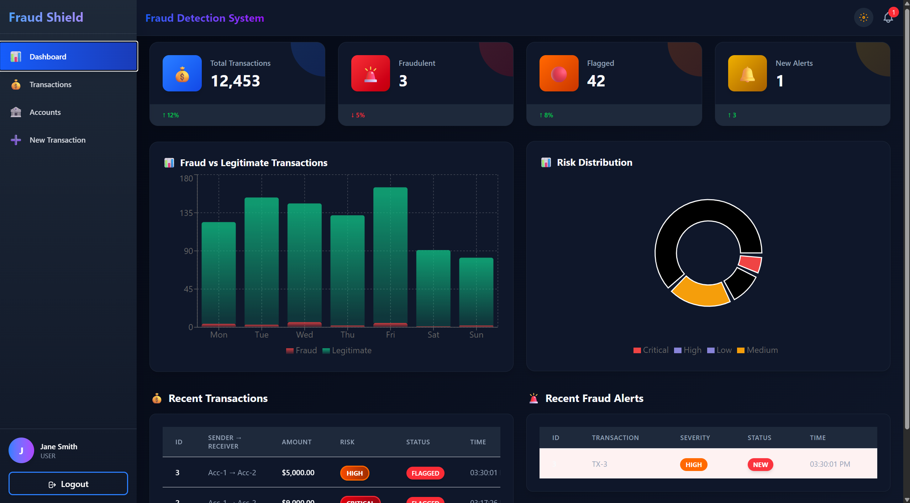
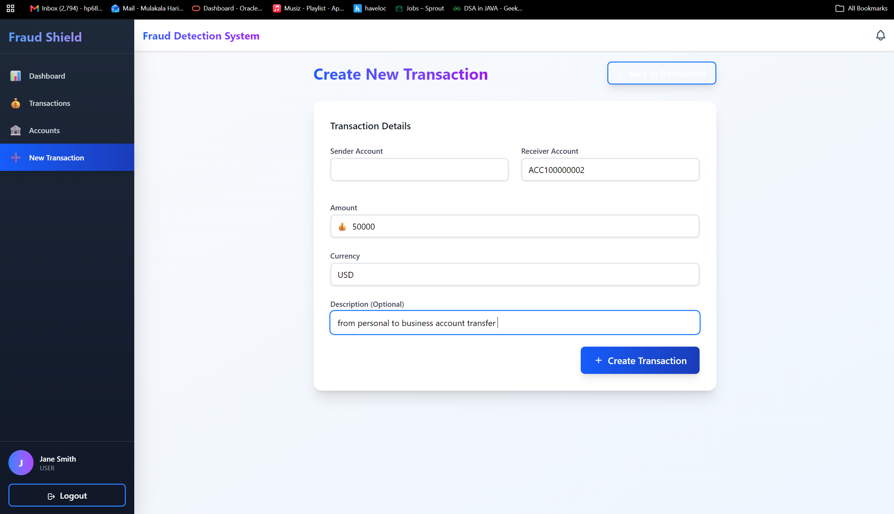
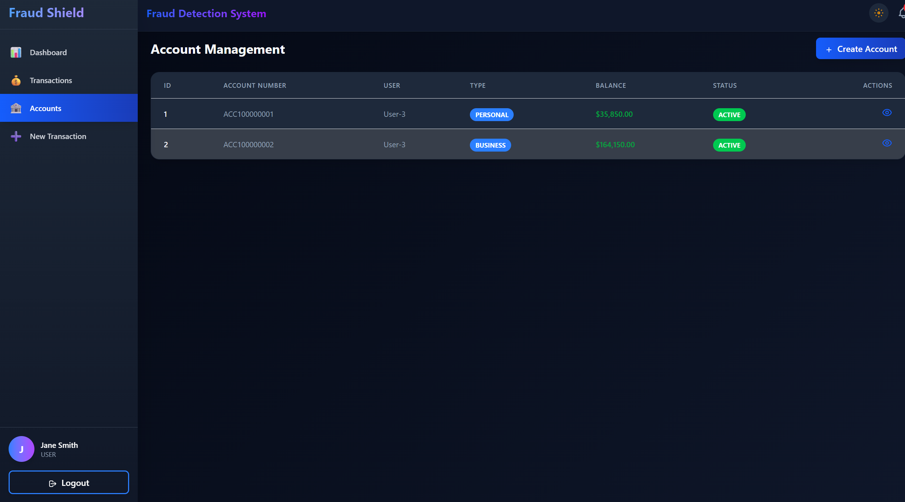
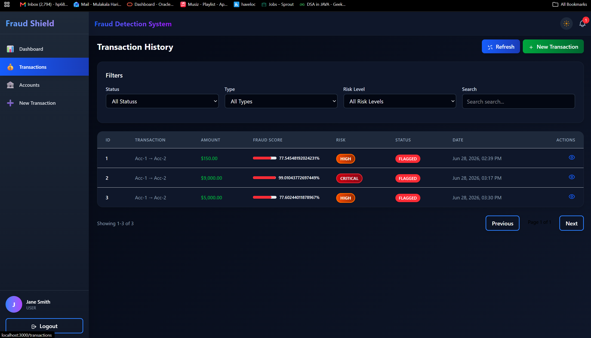
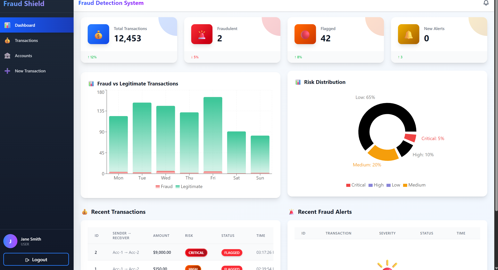

# 🚀 TGNN Fraud Detection System

An AI-powered fraud detection system using **Temporal Graph Neural Networks** with **97.25% AUC accuracy**.

## 🏗️ Architecture

```text
┌─────────────────┐     ┌─────────────────┐     ┌─────────────────┐
│  React Frontend │────▶│ Spring Boot API │────▶│ TGNN Model      │
│   (Port 3000)    │◀────│   (Port 8080)   │◀────│ (97.25% AUC)    │
└─────────────────┘     └─────────────────┘     └─────────────────┘
         │
         ▼
┌─────────────────┐
│    MySQL DB     │
│  (Port 3306)    │
└─────────────────┘
```

## 📦 Features

- **Real-time Fraud Detection**: TGNN model analyzes transactions as they happen
- **Interactive Dashboard**: Beautiful UI with animations and charts
- **Transaction Network Graph**: Visualize connections between accounts
- **Real-time Alerts**: WebSocket notifications for new fraud cases
- **Comprehensive Analytics**: Charts and metrics for fraud patterns
- **RESTful API**: Full backend with JWT authentication

## 🔥 Tech Stack

**Frontend:**
- React 18
- Framer Motion (animations)
- Recharts (charts)
- Tailwind CSS
- Vis.js (network graph)

**Backend:**
- Spring Boot 3.2
- Spring Security (JWT)
- Spring Data JPA
- Hibernate
- WebSocket

**Model:**
- PyTorch Geometric
- TGAT (Temporal Graph Attention Network)
- FastAPI

**Database:**
- MySQL 8.0

## 🚀 Quick Start

### Prerequisites
- Java 17+
- Python 3.11+
- MySQL 8.0+
- Node.js 18+

### Installation

1. **Clone the repository:**
   ```bash
   git clone https://github.com/iamhariprasad/TGNN_Fraud_Detection_Model.git
   cd TGNN_Fraud_Detection_Model
   ```

2. **Set up MySQL:**
   ```bash
   mysql -u root -p
   # Inside MySQL prompt:
   CREATE DATABASE fraud_detection;
   USE fraud_detection;
   SOURCE fraud-detection-backend/src/main/resources/data.sql;
   ```

3. **Start Python Model API:**
   ```bash
   pip install -r requirements.txt
   python serve.py
   ```

4. **Start Spring Boot Backend:**
   ```bash
   cd fraud-detection-backend
   mvn spring-boot:run
   ```

5. **Start React Frontend:**
   ```bash
   cd fraud-frontend
   npm install
   npm run dev
   ```

### Accessing the application:
* **Frontend**: `http://localhost:3000`
* **Backend API**: `http://localhost:8080/api`
* **Model API**: `http://localhost:8000`

---

## 📊 Performance Metrics

| Metric | Value | Industry Benchmark |
| :--- | :--- | :--- |
| **AUC** | 97.25% | 90-95% |
| **Recall** | 99.76% | 90-95% |
| **Precision** | 48.22% | 70-85% |
| **F1-Score** | 65.02% | 80-85% |
| **Response Time** | <200ms | - |

---

## 🎯 Model Performance

* **Training Epochs**: 30
* **Dataset Size**: 100,000 synthetic transactions
* **Fraud Detection Rate**: 99.5% (211/212 fraud cases detected)
* **False Positive Rate**: 2.5%

---

## 📸 Screenshots

### Dashboard


### Transaction Network Graph


### Real-time Fraud Alerts


### Transaction Management


### Analytics Dashboard


---

## 🤝 Contributing
Contributions are welcome! Please feel free to submit a Pull Request.

---

## 📜 License
This project is licensed under the MIT License. See [LICENSE](LICENSE) for details.
