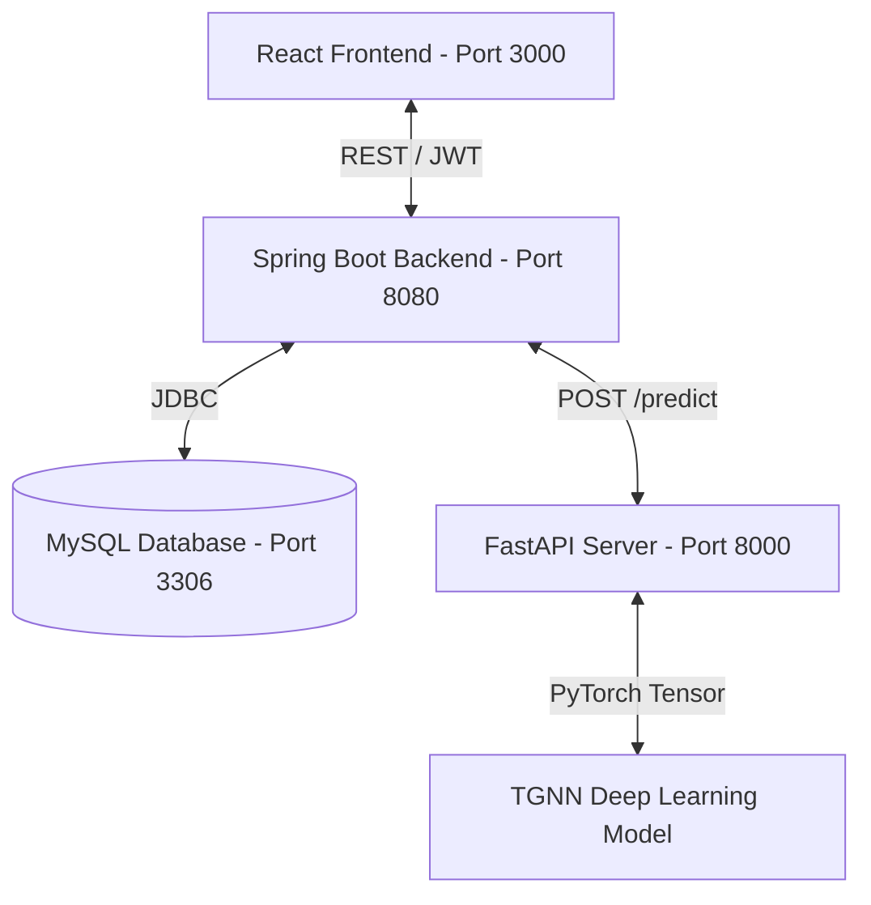

# Temporal Graph Neural Network (TGNN) Fraud Detection System

This repository contains an end-to-end, real-time fraud detection platform leveraging a Temporal Graph Neural Network (TGNN) model to predict and prevent suspicious bank transaction activities.

---

## 🏗️ System Architecture

The application is split into three main components:
1. **React Frontend**: Modern, animated dashboard for users and admins. Displays accounts, transactions, fraud alerts, and an interactive Vis.js transaction network graph.
2. **Spring Boot Backend**: Handles authentication (JWT), user accounts, transaction creation, H2/MySQL database mapping, and triggers real-time GNN predictions.
3. **PyTorch GNN Model Server**: Serves a Temporal Graph Neural Network with Graph Attention (TGAT) layers and a sinusoidal TimeEncoder to classify transactions on the fly.



---

## 🛠️ Technology Stack

* **Frontend**: React 19, Vite, Tailwind CSS, Framer Motion, Axios, Vis.js (Network Graph), Recharts.
* **Backend**: Spring Boot 3.2.0, Spring Security, Hibernate JPA, MySQL Connector/J.
* **Database**: MySQL (Port 3306).
* **Machine Learning**: Python 3.10+, PyTorch 2.x, PyTorch Geometric (PyG), FastAPI, Uvicorn.

---

## 📸 Application Screenshots

### 📊 Dashboard & Monitoring
| **Admin Dashboard Overview** | **Transaction Registry** |
| :---: | :---: |
|  |  |

| **Account Management** | **New Transaction Form** |
| :---: | :---: |
|  |  |

---

## 🚀 Local Setup & Implementation

### Prerequisite: Database Setup
1. Ensure **MySQL** is running on your machine on port `3306`.
2. The backend connects using:
   * **Database URL**: `jdbc:mysql://localhost:3306/fraud_detection`
   * **Username**: `root`
   * **Password**: `hari123` *(change this in `fraud-detection-backend/src/main/resources/application.properties` to match your local setup).*

---

### Step 1: Start the GNN Model Server
1. Navigate to the root directory:
   ```bash
   cd TGNN_Fraud_Detection_Model
   ```
2. Create and activate a Python virtual environment:
   ```bash
   python -m venv .venv
   # Windows:
   .venv\Scripts\activate
   # Linux/macOS:
   source .venv/bin/activate
   ```
3. Install required machine learning dependencies:
   ```bash
   pip install -r requirements.txt
   ```
4. Start the FastAPI model server on port `8000`:
   ```bash
   python serve.py
   ```

---

### Step 2: Start the Spring Boot Backend
1. Navigate to the backend directory:
   ```bash
   cd fraud-detection-backend
   ```
2. Build and package the Spring Boot jar using Maven:
   ```bash
   mvn clean package -DskipTests
   ```
3. Run the application:
   ```bash
   java -jar target/fraud-detection-backend-1.0.0.jar
   ```
   *The server will start on port `8080` under the context path `/api`.*

---

### Step 3: Start the React Frontend
1. Navigate to the frontend directory:
   ```bash
   cd fraud-frontend
   ```
2. Install npm packages:
   ```bash
   npm install
   ```
3. Run the development server:
   ```bash
   npm run dev
   ```
   *The dashboard will be served at `http://localhost:3000`.*

---

## 📊 Database Seeding (Loading Accounts & Transactions)

The project includes a built-in admin utility to seed the H2/MySQL database with data from `node_features.csv` and `edges.csv`:

1. Ensure the backend and model servers are running.
2. Send a POST request to the seeder endpoint (using Postman, Curl, or your terminal):
   ```bash
   # Seeds a minimum of 200 accounts and 1,000 transactions
   curl -X POST "http://localhost:8080/api/admin/seed?minAccounts=200"
   ```
3. Log into the React dashboard using administrative credentials:
   * **Username**: `admin`
   * **Password**: `admin123`
4. Navigate to the **Network Graph** or **Transactions** tab to explore the seeded dataset inside the interactive visualizer.

---

## 🌓 Dark Mode Toggle
* Toggle between Light and Dark modes seamlessly using the **Moon icon 🌙 / Sun icon ☀️** in the dashboard header.
* Preference is automatically saved in `localStorage` and persists across page reloads.

---

## 📝 Git Push Checklist
Once you create a blank repository named `TGNN_Fraud_Detection_Model` on your GitHub profile (`iamhariprasad`), run the following commands in the project root:
```bash
git add README.md
git commit -m "Add README documentation"
git push -u origin main
```
