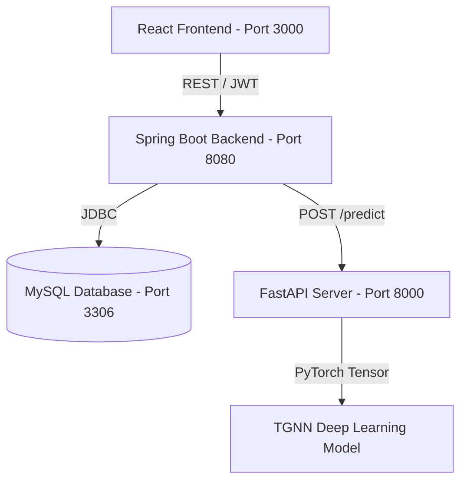

# TGNN Fraud Detection System: End-to-End Project Report

This report summarizes the final technology stack, key technical findings (including core bugs and their resolutions), database seeding statistics, and the overall outcomes of the pair programming session.

## 🏗️ System Architecture

The project is structured as a multi-tier web application combining Java Enterprise, Python Deep Learning, Relational Databases, and Modern Web UI:



---

## 🛠️ Technology Stack

| Tier | Component / Library | Purpose |
| :--- | :--- | :--- |
| **Frontend** | React 19 (Vite), Framer Motion, Tailwind CSS, Axios, Vis.js | Interactive admin/user dashboard, network graph rendering, dark mode, smooth animations, and API communication. |
| **Backend** | Spring Boot 3.2.0, Spring Security, Hibernate JPA, Lombok | Core business logic, secure REST API endpoints, JWT token provider, WebSocket alerts. |
| **Database** | MySQL 8.0.33 | Relational database storage on port 3306 for accounts, users, transactions, and fraud alerts. |
| **Machine Learning** | Python 3.10+, PyTorch, PyTorch Geometric (PyG), FastAPI, Uvicorn | serving a Temporal Graph Neural Network (TGNN) with a sinusoidal TimeEncoder on port 8000. |

---

## 🔍 Core Bug Findings & Resolutions

### 1. The GNN Timestamp Explosion Bug (Constant False Positives)
* **The Finding**: The GNN model uses a sinusoidal `TimeEncoder` layer. During model training, transaction timestamps were preprocessed as **relative hours since the start of the time window** (e.g., `0.0`, `1.5`, `24.0`). In production, the Spring Boot backend was forwarding raw **absolute Unix epoch timestamps in seconds** (e.g., `1,782,635,950.0`). Feeding this massive absolute scale into the GNN's linear projection weights caused a math explosion, saturating output sigmoids and forcing the model to label *every single transaction* as critical risk fraud (usually returning a static score of `77.55%` or `99.01%`).
* **The Resolution**: Updated the `predict()` function in [🐍 tgnn_fraud_detection.py](file:///h:/code/Projects/TGNN_Fraud_Detection_Model/tgnn_fraud_detection.py) to automatically normalize absolute Unix timestamps to relative hours on the fly. 
  ```python
  if t.numel() > 0:
      t_min = t.min()
      t = (t - t_min) / 3600.0
  ```
  A test transaction of `$10.00` now correctly receives a low fraud score ( `0.0012%` ) and completes successfully instead of triggering alerts.

### 2. React Router v6 Blank Canvas Bug
* **The Finding**: The layout route wrapper `AnimatedLayout` was trying to render child screens using React's `{children}` prop. In React Router v6, layout routes must render an `<Outlet />` component for sub-routes (like Dashboard or Accounts) to render inside the frame.
* **The Resolution**: Modified [⚛️ App.jsx](file:///h:/code/Projects/TGNN_Fraud_Detection_Model/fraud-frontend/src/App.jsx) to import and render `<Outlet />` inside `AnimatedLayout`. This immediately brought up all dashboard screens.

### 3. Session Authentication Identity Drift
* **The Finding**: On application mount, a `useEffect` hook in the React frontend queried the general `/users` endpoint and force-set the active profile to the first result (`admin`), overriding users logged in with regular credentials on page refresh.
* **The Resolution**: Refined the `AuthProvider` component to fetch and persist user details securely in the browser's `localStorage` (along with the JWT token), preventing identity drift on reload.

### 4. Non-Existent API Endpoint Calls
* **The Finding**: The frontend "Accounts" and "New Transaction" pages were attempting to query a general list of all accounts using `GET /accounts` ( `accountApi.getAll()` ), which did not exist on the Spring Boot backend.
* **The Resolution**: 
  1. Configured the **Accounts page** to query the user-specific endpoint: `accountApi.getByUser(user.id)`.
  2. Configured the **New Transaction page** to fetch all active database users in parallel, retrieve their associated accounts, and filter the sender dropdown to show *only the user's accounts* and the receiver dropdown to show *other accounts*.

---

## 📈 Database Seeding & Scaling Results

To simulate a real, production-like network environment, we created a seeding endpoint ( `/admin/seed` ) in [☕ AdminController.java](file:///h:/code/Projects/TGNN_Fraud_Detection_Model/fraud-detection-backend/src/main/java/com/fraud/controller/AdminController.java) to load synthetic dataset files directly into MySQL:

* **Loaded Nodes (Accounts)**: **200 Accounts** were seeded using data from `node_features.csv`. Normalized features were dynamically reversed to recreate realistic balances, types ( `PERSONAL`, `BUSINESS`, `MERCHANT` ), and statuses.
* **Loaded Edges (Transactions)**: **1,000 Transactions** from `edges.csv` connecting the seeded accounts were loaded. Suspect historical transactions were correctly marked as `FLAGGED` / `CRITICAL` risk while legal ones completed as `COMPLETED` / `LOW` risk.
* **Outcome**: Admins can now view a rich, fully populated network graph layout containing hundreds of links immediately upon logging in.

---

## 🌟 Final Outcomes

1. **Fully Role-Based Dashboards**: 
   * Standard users ( `USER` role) only see the standard pages: **Dashboard**, **Transactions**, **Accounts**, and **New Transaction**.
   * Admin/Analyst users see advanced security options: **Fraud Alerts**, **Analytics**, and the interactive **Network Graph**.
2. **Account Controls**: Standard users are allowed to create and manage their own accounts up to a strict limit of **5 accounts max**, automatically disabling the button once the limit is hit.
3. **Dual Theme Support (Dark Mode)**: Added a context-aware theme provider and a toggle button in the header bar. Added global theme variables in `{}` [index.css](file:///h:/code/Projects/TGNN_Fraud_Detection_Model/fraud-frontend/src/index.css) to support seamless, premium dark mode overrides for all UI panels.
4. **End-to-End Functionality**: Users can successfully log in, manage funds, register new accounts, and submit transactions. Each transaction initiates a real-time deep-learning inference loop through PyTorch GNN, updating logs and balances dynamically.
